# Le Pendouillant

- [Le Pendouillant](#le-pendouillant)
  - [Introduction](#introduction)
  - [Pré-requis](#pré-requis)
    - [Sources](#sources)
    - [Installation de l'application](#installation-de-lapplication)
  - [Menus](#menus)
    - [Menu principal](#menu-principal)
    - [Menu des options](#menu-des-options)
      - [Description des niveaux de difficultés](#description-des-niveaux-de-difficultés)
      - [Description des modes de jeu](#description-des-modes-de-jeu)
  - [Déroulement d'une partie](#déroulement-dune-partie)

## Introduction

L'application **Le Pendouillant** vous permet de jouer au classique jeu du pendu dans une version informatisée en français.

## Pré-requis

Pour utiliser cette application, vous aurez besoin d'un ordinateur (même ancien) exécutant Windows.

### Sources

Vous pouvez récupérer les sources sur [GitHub](https://github.com/Agatolies/HangmanPAP), ouvrir le projet (de préférence avec Code::Block) et les compiler à l'aide du compilateur GCC.

### Installation de l'application

Lorsque vous avez récupérer le fichier **.exe** de l'application, double-cliquez dessus afin de l'ouvrir. Vous verrez s'afficher le menu principal de l'application.

## Menus

### Menu principal

Le menu principal vous permet de naviguer dans les options de l'application ou de démarrer une nouvelle partie.

Les 4 options suivantes sont disponibles :
* **<1>** pour démarrer une nouvelle partie
* **<2>** pour modifier les options de jeu
* **<3>** pour aller sur l'écran "A propos"
* **Q** pour quitter le programme

Pour saisir votre choix, appuyez sur la touche représentée entre chevrons et appuyez sur la touche entrée pour le valider. 

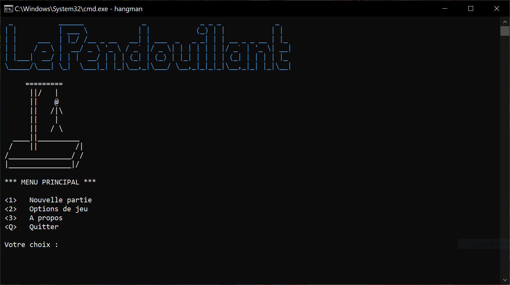

Si l'utilisateur sélectionne le caractère 'Q', le programme s'arrête.

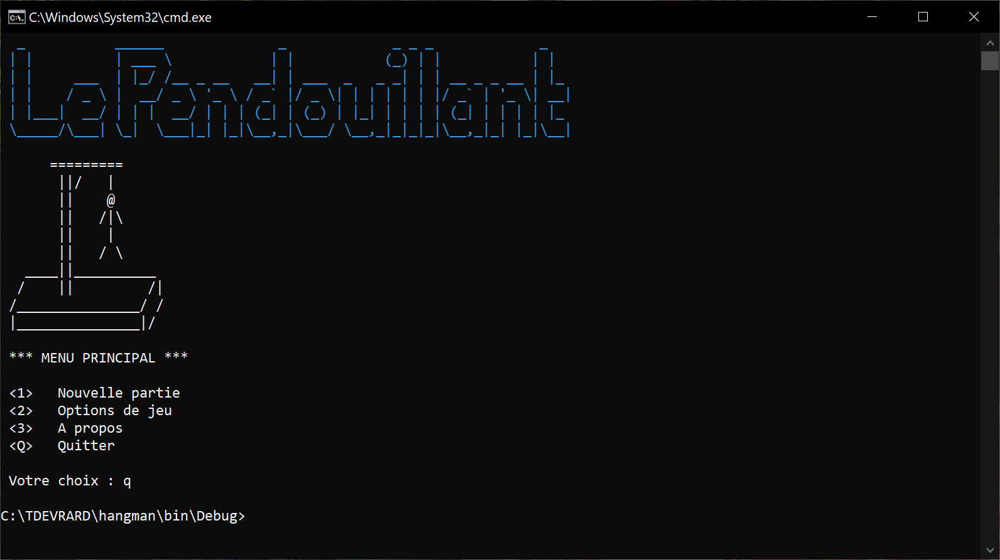

L'écran a propos contient les informations sur le jeu du pendu.

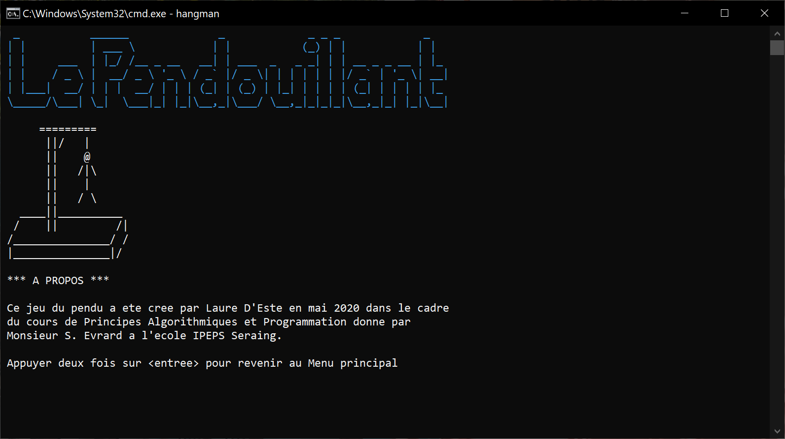

### Menu des options

Le menu des options vous permet de consulter les options courantes du jeu et de les éditer. Ces options sont sauvegardées dans un fichier qui est automatiquement lu au démarrage de l'application. Si ce fichier n'existe pas, il est automatiquement créé et rempli avec les options par défaut (Mode Visible, Niveau de difficulté 2).

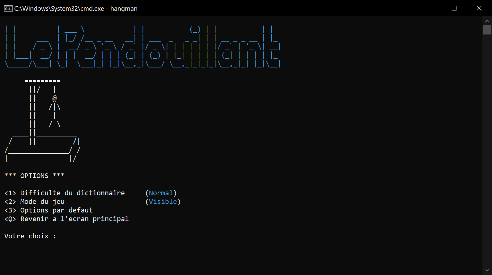

#### Description des niveaux de difficultés

Il existe 5 niveaux de difficultés différents, à chaque niveau son dictionnaire de mots.

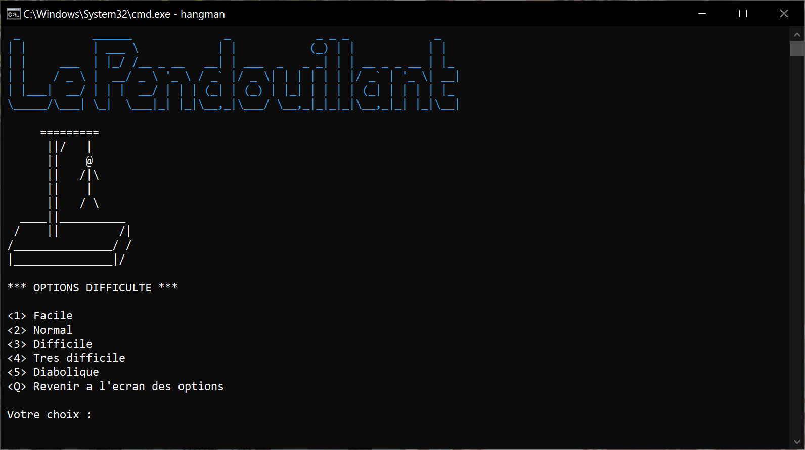

#### Description des modes de jeu

Il existe 3 modes de jeu différents.

Le mode "**visible**" affiche la partie du mot déjà trouvée et les lettres erronées déjà proposées.

Le mode "**intermédiaire**" n'affiche que la partie du mot déjà trouvée.

Le mode "**invisible**" n'indique ni les lettres erronées déjà proposées ni les lettres correctes déjà proposées. Le mot secret apparait sous forme de '+' si la lettre a déjà été trouvée et de '?' quand la lettre est inconnue.

L'option **Q** renvoie l'utilisateur à l'écran principal.

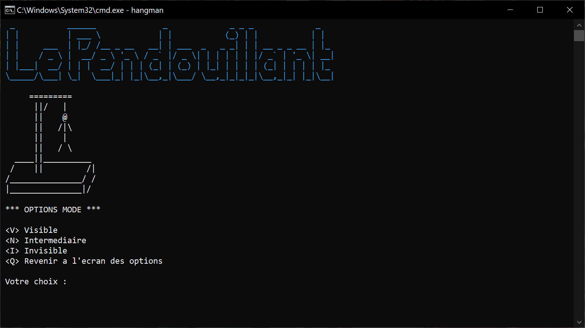

Une fois les options de difficultés et de modes sont choisies, elles apparaissent dans l'écran des options.

## Déroulement d'une partie

Une partie débute avec une potence vide. Le pendu apparaît petit à petit en fonction du nombre d'erreurs commises par l'utilisateur. La tête en premier, puis le tronc, le bras gauche, le bras droit, la jambe gauche et enfin la jambe droite.

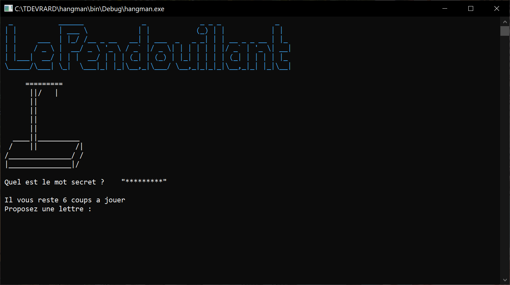

En mode **Visible** le message reprenant les lettres erronées déjà proposées apparaît. Ce n'est pas le cas pour les autres modes.

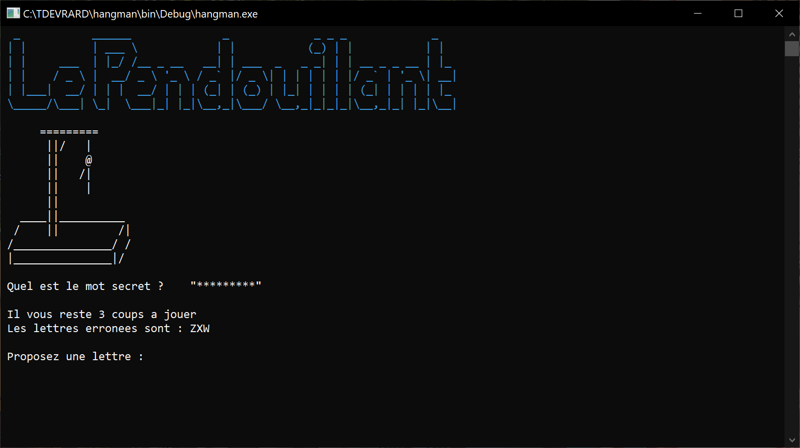

Dans tous les modes, un message précisant qu'une lettre a déjà été proposée apparait durant 2 secondes si l'utilisateur soumet une même lettre une seconde fois. Aucun coups ne lui est alors retiré.

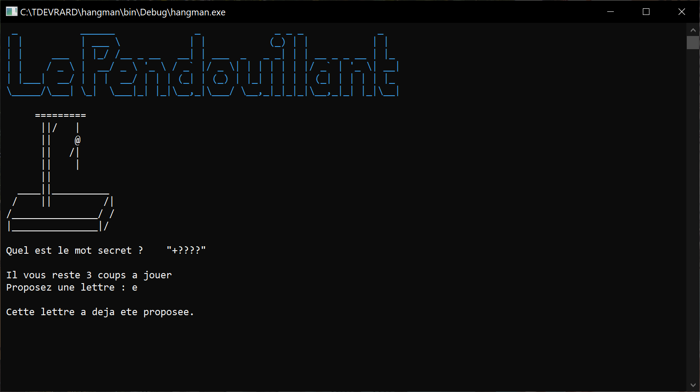

Voici un exemple d'écran en mode invisible.

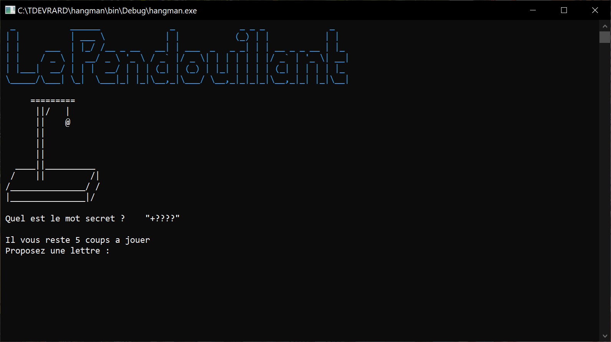

Si l'utilisateur  propose autre chose qu'une lettre de l'alphabet (ex un chiffre), le message "Saisie incorrecte" apparait et il peut proposer une nouvelle lettre.

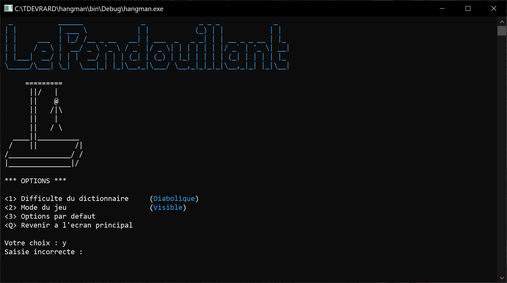

Lorsqu'il n'y plus de coups disponibles ou que le mot à été trouvé. Il se verra présenté à l'utilisateur l'un des messages suivants : 

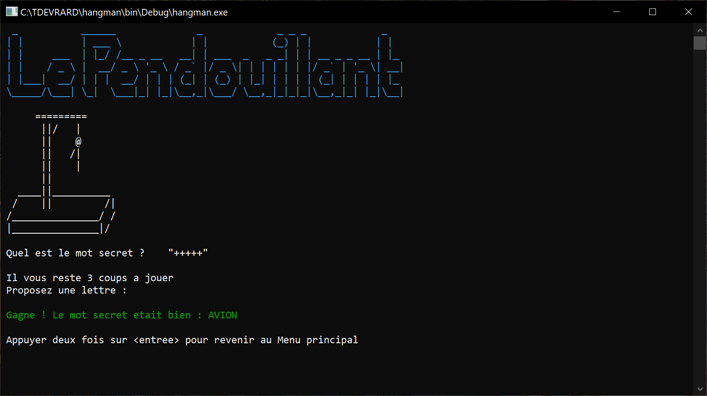
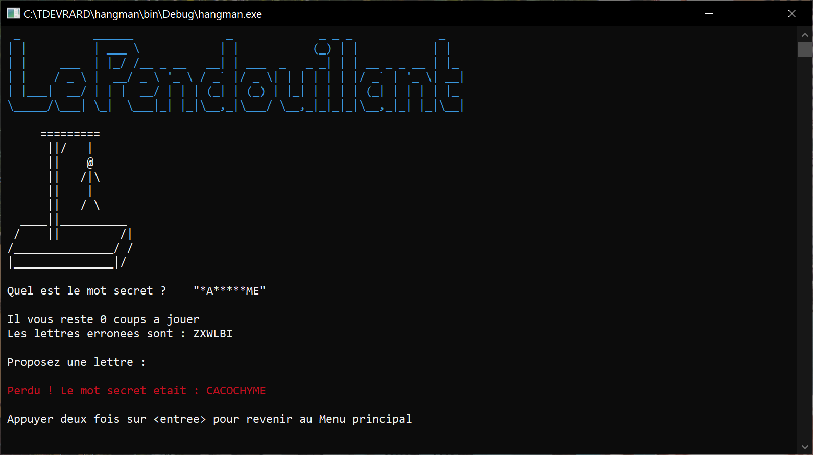

